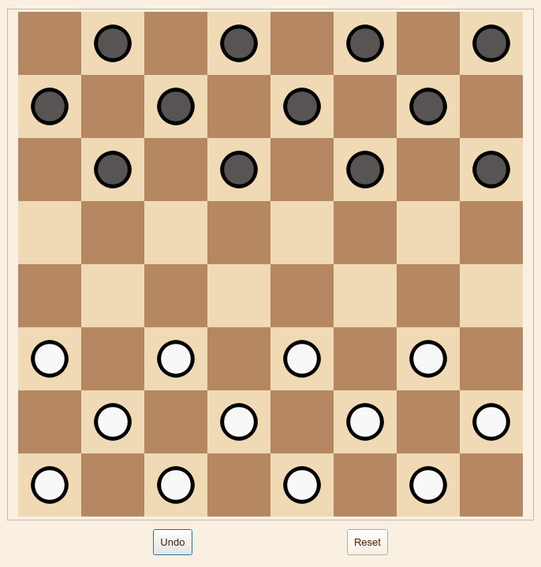

## Requirements 
### Install graphviz (used to draw the svg)
you can download it from [here](https://graphviz.org/download/)

## Screenshots

### Checkers

### SlidingPuzzle

### Connect 4

### NQueen

## Install Instructions 

- In the root directory create a python environment 
```sh
    python3 -m venv venv
```

### Windows 
```shell
    venv\Scripts\Activate.ps1
```

### Unix
```shell
    source venv/bin/activate
```
### Install the requirements.
```shell
    pip3 install -r requirements.txt 
    python3 main.py
```
